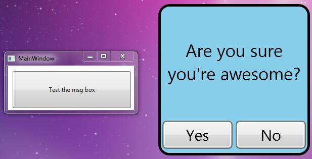

CustomYesNoDialogWPF
====================

A simple example of how to make a custom YES/NO dialog with DialogResult in WPF.

MsgBoxYesNo.xaml:

    <Window x:Class="CustomYesNoDialogWPF.MsgBoxYesNo"
	        xmlns="http://schemas.microsoft.com/winfx/2006/xaml/presentation"
	        xmlns:x="http://schemas.microsoft.com/winfx/2006/xaml"
	        Title="MsgBoxYesNo" Height="300" Width="300"
	        WindowStyle="None" ResizeMode="NoResize"
	        WindowStartupLocation="CenterScreen"
	        AllowsTransparency="True" Background="Transparent">

	    <Border BorderThickness="5" BorderBrush="Black" CornerRadius="20" Background="SkyBlue">
	        <Grid>
	            <Grid.RowDefinitions>
	                <RowDefinition Height="3*"></RowDefinition>
	                <RowDefinition Height="1*"></RowDefinition>
	            </Grid.RowDefinitions>

	            <Grid.ColumnDefinitions>
	                <ColumnDefinition></ColumnDefinition>
	            </Grid.ColumnDefinitions>

	            <Viewbox>
	                <TextBlock x:Name="txtMessage" Width="420" FontSize="50" TextWrapping="Wrap" HorizontalAlignment="Center" VerticalAlignment="Center" TextAlignment="Center" Text="Are you sure you're awesome?"/>
	            </Viewbox>

	            <Viewbox Grid.Row="1">
	                <StackPanel Orientation="Horizontal">
	                    <Button Content="Yes" x:Name="Yes" Margin="1" HorizontalAlignment="Left" VerticalAlignment="Top" Width="55" Click="Yes_Click"/>
	                    <Button Content="No" x:Name="No" Margin="1" HorizontalAlignment="Left" VerticalAlignment="Top" Width="55" Click="No_Click" IsCancel="True"/>
	                </StackPanel>
	            </Viewbox>
	        </Grid>
	    </Border>
	</Window>

MsgBoxYesNo.cs:

    public partial class MsgBoxYesNo : Window
    {
        public MsgBoxYesNo(string message)
        {
            InitializeComponent();

            txtMessage.Text = message;
        }

        private void Yes_Click(object sender, RoutedEventArgs e)
        {
            DialogResult = true;
            this.Close();
        }

        private void No_Click(object sender, RoutedEventArgs e)
        {
            DialogResult = false;
            this.Close();
        }
    }

MainWindow.cs:

    private void Button_Click(object sender, RoutedEventArgs e)
    {
        MsgBoxYesNo msgbox = new MsgBoxYesNo("Are you sure you're awesome?");
        if ((bool)msgbox.ShowDialog())
        {
            MessageBox.Show("Yes, you're awesome!");
        }
        else
        {
            MessageBox.Show("You're kidding, of course you're awesome!");
        }
    }

Code is free as in beer, do with it whatever you want...